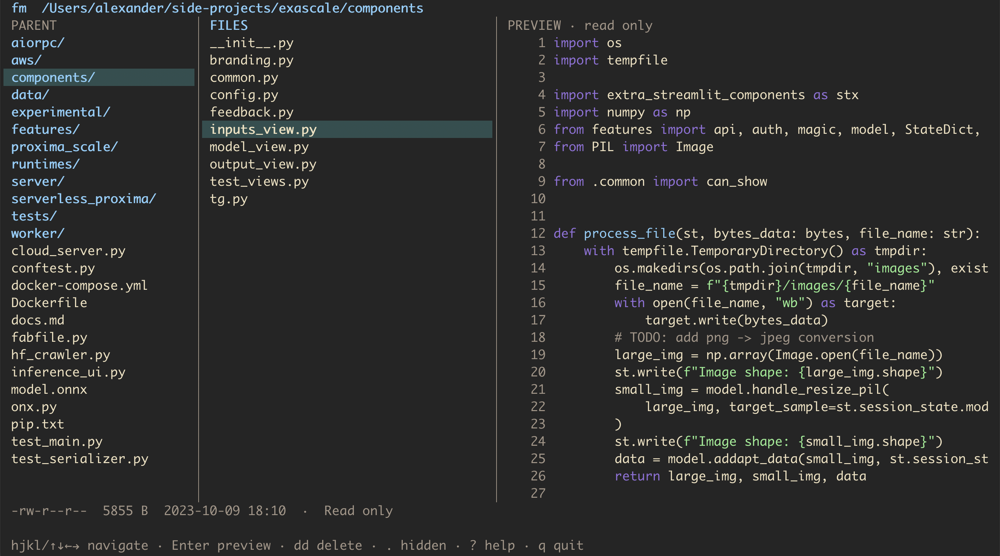

# fm

A small Go terminal file manager inspired by [ranger](https://github.com/ranger/ranger). Parent, current directory, and preview panes; directories sort first. On narrower terminals the parent pane is hidden.



## Install with Go

Requires Go 1.26.1 or newer and an interactive terminal on macOS or Linux.

```sh
go install github.com/msoedov/fm@latest
fm                   # current directory
fm ~/Downloads       # chosen directory
```

Go installs the binary to `GOBIN` when set, otherwise to `$(go env GOPATH)/bin`
(usually `~/go/bin`). Add that directory to your `PATH`.

## Build from source

Clone the repository and run:

```sh
make b               # build ./fm
./fm                 # current directory
./fm ~/Downloads     # chosen directory
```

Use `make t` to run tests and vet, and `make i` to install to
`~/.local/bin/fm`. Add `~/.local/bin` to your `PATH` if needed.
Override the install location with `make i PREFIX=/usr/local` or
`make i BINDIR=/your/bin`.

Without Make, build with `go build -o fm .`.

## Behavior

Text previews use Chroma syntax highlighting and never open an editor or execute files. Previews read at most 256 KiB, mark truncation, and identify binary and special files without displaying their contents. Tabs display as four spaces. Directory previews list children. File content changes appear after refresh.

`c` copies the selected path to the clipboard; `cc` copies the file content instead (regular files up to 64 MiB). Uses `pbcopy`, `wl-copy`, `xclip`, or `xsel`, falling back to the terminal's OSC 52 clipboard.

Deletion is permanent, including all contents of non-empty directories. Deleting a symlink removes the link, not its target. Replacements detected before deletion are rejected.

Uses tcell for terminal input/rendering and Chroma for highlighting. No external preview commands are required.

## Checks

```sh
go test ./...
go vet ./...
```

## License

[MIT](LICENSE) © 2026 Alexander Myasoedov.
